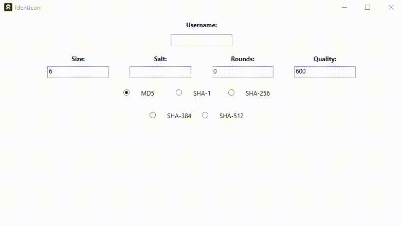

# Identicons

    <b> A simplistic identicon generator programmed in C# using WPF. </b>

   

This application is a basic identicon generator software created in C# with the aid of the WindowsCodeAPI-Shell and Core libaries. This program was made in order to explore cryptography, specifically hashing and salting strings and how they are visualized.

## Prerequisites

The running of this program requires several libraries these include:

* WindowsAPICodePack-Core - 1.1.1
* WindowsAPICodePack-Shell - 1.1.1

## Authors

* **Shaan Khan** - *All Work*

## Acknowledgements

* N/A

## License

This project is licensed under the Mozilla Public License 2.0 - see the [LICENSE](https://github.com/ShaanCoding/Identicons/blob/master/LICENSE.md) files for details
